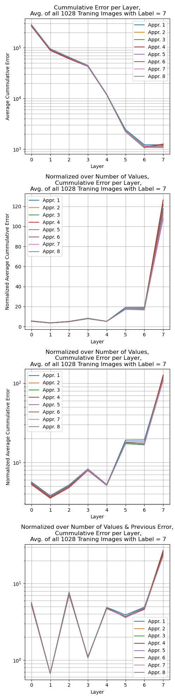
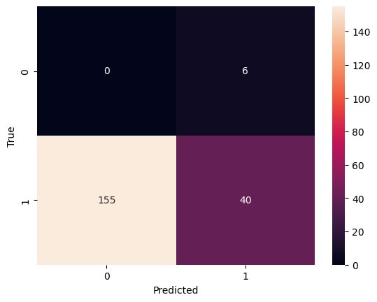

# Exercise 2
# Teammember: Dominik Gausepohl, Maximilian Burr

## All Exercises are also stored in the Jupyter Notebook Ex02

## We provided pre calculated Images in the pickle files. The can be load in the jupyter notebook. 

The calculations contain image index of MNIST from 0 to 200 with the given CNN. All approximators are used for the calculations.

## 2.1

## 2.2

| Approximator | Accuracy | Precision | Recall | F1 |
| --- | --- | ---  | ---------- | ------- |
| Approximator0   |  0.7960199004975125| 0.7960199004975125 |   0.1276595744680851         |   0.2200320880128352      |
| Approximator1   | 0.7960199004975125 | 0.7960199004975125 |   0.1276595744680851         |   0.2200320880128352      |
| Approximator2   | 0.7960199004975125 | 0.1276595744680851 |   0.1276595744680851         |    0.2200320880128352     |
| Approximator3   |  0.8009950248756219| 0.13043478260869565 |     0.1276595744680851       |   0.2200320880128352      |
| Approximator4   | 0.8009950248756219 | 0.13043478260869565 | 0.13043478260869565           |   0.22433813283790058      |
| Approximator5   |  0.8009950248756219| 0.8009950248756219 |  0.13043478260869565          |   0.22433813283790058      |
| Approximator6   |  0.7960199004975125| 0.7960199004975125 |     0.1276595744680851       |    0.2200320880128352     |
| Approximator7   | 0.7960199004975125 | 0.7960199004975125 |    0.1276595744680851        |   0.2200320880128352
| Approximator8   | 0.8009950248756219 | 0.8009950248756219 |   0.13043478260869565         |   0.22433813283790058      |

### Raw

F1 Score

Check for Approximator 0
Accuracy 0.7960199004975125
Precision: 0.7960199004975125
Recall: 0.1276595744680851
F1: 0.2200320880128352

Check for Approximator 1
Accuracy 0.7960199004975125
Precision: 0.7960199004975125
Recall: 0.1276595744680851
F1: 0.2200320880128352

Check for Approximator 2
Accuracy 0.7960199004975125
Precision: 0.7960199004975125
Recall: 0.1276595744680851
F1: 0.2200320880128352

Check for Approximator 3
Accuracy 0.8009950248756219
Precision: 0.8009950248756219
Recall: 0.13043478260869565
F1: 0.22433813283790058

Check for Approximator 4
Accuracy 0.8009950248756219
Precision: 0.8009950248756219
Recall: 0.13043478260869565
F1: 0.22433813283790058

Check for Approximator 5
Accuracy 0.8009950248756219
Precision: 0.8009950248756219
Recall: 0.13043478260869565
F1: 0.22433813283790058

Check for Approximator 6
Accuracy 0.7960199004975125
Precision: 0.7960199004975125
Recall: 0.1276595744680851
F1: 0.2200320880128352

Check for Approximator 7
Accuracy 0.7960199004975125
Precision: 0.7960199004975125
Recall: 0.1276595744680851
F1: 0.2200320880128352

Check for Approximator 8
Accuracy 0.8009950248756219
Precision: 0.8009950248756219
Recall: 0.13043478260869565
F1: 0.22433813283790058

### Label 7 Check Confusion Matrix for Approximator 0 to 8

#### Approximate 0 (Exact)

#### Approximate 1

#### Approximate 2

#### Approximate 3

#### Approximate 4

#### Approximate 5

#### Approximate 6

#### Approximate 7

#### Approximate 8

